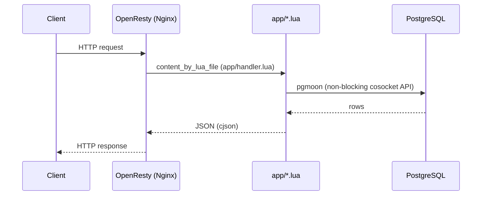

# 

> OpenResty Lua codebase containing real world examples (CRUD, auth, advanced patterns, etc) that adheres to the [RealWorld](https://github.com/realworld-apps/realworld) spec and API.

### [Demo](https://demo.realworld.build/)&nbsp;&nbsp;&nbsp;&nbsp;[RealWorld](https://github.com/realworld-apps/realworld)

This codebase demonstrates a fully fledged backend API built with **OpenResty** and **Lua**, including CRUD operations, JWT authentication, routing, and PostgreSQL integration. It passes the RealWorld API compatibility suite (`specs/run-api-tests-hurl.sh`).

## How it works



- **OpenResty**: Nginx with LuaJIT — non-blocking I/O, high concurrency, packaged and patched on Debian
- **pgmoon**: pure-Lua PostgreSQL driver on the cosocket API; parameterized queries throughout
- **lua-resty-jwt**: HS256 JWT tokens
- **argon2**: Argon2id password hashing
- **cjson**: JSON encoding/decoding
- **Custom router** ([app/router.lua](app/router.lua)): a small routing table with `:param` extraction — no framework

## Project structure

```
├── Makefile             # init, start, stop, test, lint, clean
├── nginx.conf           # OpenResty configuration
├── index.html           # Landing page
├── app/
│   ├── handler.lua      # Entry point: resolves config, dispatches to router
│   ├── router.lua       # Routing table, JSON response handling
│   ├── routes.lua       # Route registration
│   ├── auth_routes.lua  # /api/users, /api/user
│   ├── article_routes.lua  # /api/articles, comments, favorites, tags
│   ├── profile_routes.lua  # /api/profiles
│   ├── web.lua          # Shared helpers (auth token resolution, responses)
│   ├── db.lua           # SQL queries via pgmoon
│   ├── jwt.lua          # JWT wrapper around resty.jwt
│   ├── password.lua     # Argon2id hashing
│   ├── config.lua       # Environment variable resolution
│   └── dotenv.lua       # .env file loader
├── sql/schema.sql       # PostgreSQL schema
├── specs/               # RealWorld Hurl compatibility suite + OpenAPI spec
└── target/              # Runtime files: pid, logs, nginx temp dirs (gitignored)
```

All runtime state (pid file, logs, nginx temp directories) lives under `target/`, so the working tree stays clean. `make clean` empties it (and refuses to run while the server is up).

## Getting started

Requires [OpenResty](https://openresty.org/), [LuaRocks](https://luarocks.org/), PostgreSQL, and [mise](https://mise.jdx.dev/) (which provides hurl and lua-language-server).

```bash
cp .env.example .env   # or create .env with PGHOST, PGPORT, PGDATABASE, PGUSER, PGPASSWORD, JWT_SECRET

make init      # check dependencies, install Lua rocks, load sql/schema.sql
make start     # start the server on port 8081
make test      # run the RealWorld API compatibility suite (Hurl)
make load-test # read-dominated load test with hey, concurrency doubling 1 -> 64
make lint      # lua-language-server static analysis
make stop      # stop the server
make clean     # remove runtime files in target/
```

## Load testing

`make load-test` runs [specs/run-load-tests.sh](specs/run-load-tests.sh) (POSIX sh, requires
[hey](https://github.com/rakyll/hey)): readers hammer the article list and detail endpoints at
full speed with concurrency doubling 1 → 64, while writers post comments and favorites at a
limited rate, keeping the mix ~99% reads. The test fails on any HTTP 500 — under overload the
server must shed load with 503 (`limit_conn` in [nginx.conf](nginx.conf) caps in-flight API
requests below PostgreSQL's `max_connections`), never break.

## Docker (Debian Trixie)

The image builds on `debian:trixie-slim` using Debian's own nginx + lua-nginx-module packages
(`libnginx-mod-http-lua`, `lua-resty-core`, `lua-cjson`), which receive security patches for the
lifetime of Debian 13 — LTS until 30 June 2030. Only the three libraries Debian does not package
(pgmoon, lua-resty-jwt, argon2) come from LuaRocks at build time.

```bash
docker build -t realworld-openresty-lua .

# Configuration is injected at run time from an env file (see .env.example)
docker run --rm -p 8081:8081 --env-file .env realworld-openresty-lua
```

Point it at any PostgreSQL by swapping the env file — e.g. a managed database with
`PGSSLMODE=require`. Apply [sql/schema.sql](sql/schema.sql) to the target database first
(`make db-reset` does this for the database in `.env`).

## License

[MIT](LICENSE)
