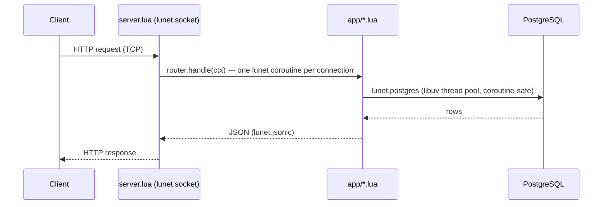

# 

> Lua codebase containing real world examples (CRUD, auth, advanced patterns, etc) that adheres to the [RealWorld](https://github.com/realworld-apps/realworld) spec and API.

### [Demo](https://demo.realworld.build/)&nbsp;&nbsp;&nbsp;&nbsp;[RealWorld](https://github.com/realworld-apps/realworld)

This codebase demonstrates a fully fledged backend API built with **[lunet](https://github.com/lua-lunet/lunet)** (a libuv + LuaJIT coroutine networking runtime) and **PostgreSQL**, including CRUD operations, JWT authentication, routing, and no framework beyond a small router. It passes the RealWorld API compatibility suite (`specs/run-api-tests-hurl.sh`).

## How it works



- **lunet**: standalone libuv + LuaJIT runtime — no nginx, no OpenResty; `server.lua` runs its own accept loop with `lunet.socket`, spawning one coroutine per connection
- **lunet.postgres**: native PostgreSQL driver built on libpq; queries run on libuv's thread pool so a slow query never blocks the event loop
- **lib/crypto.lua**: libsodium via LuaJIT FFI — Argon2id password hashing, HMAC-SHA256 for JWT signing, base64url, CSPRNG
- **lunet.jsonic**: fast Rust-backed JSON decoding with a bundled dkjson encoder (API-compatible for this app's `encode`/`decode`/`null` usage)
- **lunet.lnt_shared**: sharded in-process dictionary with atomic counters — backs the request metrics exposed on `/health` ([app/metrics.lua](app/metrics.lua))
- **Custom router** ([app/router.lua](app/router.lua)): a small routing table with `:param` extraction, driven by a per-request context object ([compat/ngx_context.lua](compat/ngx_context.lua)) rather than a global — safe under concurrent coroutines
- **Custom HTTP parsing** ([lib/http.lua](lib/http.lua)): request/response (de)serialization over raw sockets

## Project structure

```
├── Makefile               # init, start, stop, test, lint, clean
├── server.lua              # Entry point: lunet accept loop, dispatches to router
├── index.html               # Landing page
├── app/
│   ├── router.lua          # Routing table, JSON response handling
│   ├── routes.lua          # Route registration
│   ├── auth_routes.lua     # /api/users, /api/user
│   ├── article_routes.lua  # /api/articles, comments, favorites, tags
│   ├── profile_routes.lua  # /api/profiles
│   ├── web.lua             # Shared helpers (auth token resolution, responses)
│   ├── db.lua              # SQL queries via lunet.postgres
│   ├── jwt.lua              # HS256 JWT encode/decode, built on lib/crypto
│   ├── password.lua        # Argon2id hashing, built on lib/crypto
│   ├── metrics.lua         # Request counters via lunet.lnt_shared, exposed on /health
│   ├── config.lua          # Environment variable resolution
│   └── dotenv.lua          # .env file loader
├── lib/
│   ├── crypto.lua          # libsodium FFI: hashing, HMAC, base64, CSPRNG
│   └── http.lua            # HTTP request parsing / response building
├── compat/
│   └── ngx_context.lua     # Per-connection request context passed into router.handle()
├── edge.lua                 # Optional second lunet instance: serves the frontend + proxies /api
├── edge/public/             # Prebuilt frontend assets (gitignored; fetched by make frontend)
├── scripts/
│   ├── deps.sh              # Fetches the lunet binary release into bin/
│   └── frontend.sh          # Fetches the prebuilt frontend into edge/public/
├── bin/                     # lunet binaries (gitignored; created by make deps)
├── sql/schema.sql          # PostgreSQL schema
├── specs/                  # RealWorld Hurl compatibility suite + OpenAPI spec
└── target/                 # Runtime files: pid, logs, local Postgres data dir (gitignored)
```

All runtime state (pid file, logs) lives under `target/`, so the working tree stays clean. `make clean` empties it (and refuses to run while the server is up).

## Getting started

Requires PostgreSQL and [mise](https://mise.jdx.dev/) (which provides hurl and lua-language-server). No compiler or toolchain is needed — lunet is consumed as a prebuilt binary release.

```bash
cp .env.example .env   # or create .env with PGHOST, PGPORT, PGDATABASE, PGUSER, PGPASSWORD, JWT_SECRET

make deps      # fetch lunet binaries into bin/ (seconds; no xmake)
make init      # check dependencies, load sql/schema.sql
make start     # start the server on port 8081
make test      # run the RealWorld API compatibility suite (Hurl)
make load-test # read-dominated load test with hey, concurrency doubling 1 -> 64
make lint      # lua-language-server static analysis
make stop      # stop the server
make clean     # remove runtime files in target/
```

## Binary dependencies (`bin/`)

Nothing here is compiled — there is no xmake or cargo step anywhere. `make deps`
([scripts/deps.sh](scripts/deps.sh)) downloads the tagged release archive (`v0.4.4`)
from [lunet releases](https://github.com/lua-lunet/lunet/releases) and extracts it
into `bin/` in seconds. The archive carries everything the app needs:

- `lunet-run` + `lunet.so` — `lunet-run` resolves its core library and drivers
  relative to its own location, so the archive layout is kept as-is
- the drivers `lunet/{postgres,mysql,httpc,sqlite3,paxe}.so`
- the `lnt_shared` and `jsonic` ext modules (shipped in the archive since v0.4.4,
  see [lunet#115](https://github.com/lua-lunet/lunet/issues/115)): each module's Lua
  loader resolves its compiled library relative to the loader's own directory —
  `lunet/lnt_shared.lua` + `lunet/liblnt_shared.{dylib,so}` and
  `lunet/jsonic.lua` + `lunet/dkjson-encode-v2.10.lua` + `lunet/liblunet_jsonic.{dylib,so}`

`server.lua` adds `./bin/?.lua` to `package.path` so `require("lunet.lnt_shared")` and
`require("lunet.jsonic")` find those loaders.

Runtime shared-library dependencies of the release binaries (already present if you
previously built lunet from source):

- **macOS** (the release links against Homebrew kegs): `brew install luajit libuv libpq libsodium`
- **Debian/Ubuntu**: `apt install libluajit-5.1-2 libuv1 libpq5 libsodium23 libsqlite3-0`
  (runtime packages only — no `-dev` packages, no toolchain). Note: `libsodium23` ships only
  the versioned `libsodium.so.23`; FFI users need an unversioned `libsodium.so` symlink, which
  the [Dockerfile](Dockerfile) runtime stage creates.

## Docker

The image is pure lunet — no nginx, no OpenResty, and **no toolchain at all** (no xmake,
no cargo). The builder stage runs the same `scripts/deps.sh` as local dev (just
`curl | tar`); the runtime stage carries only the shared libraries the binaries link
against. Since lunet publishes a `linux-amd64` archive only, the image is pinned to that
platform.

```bash
docker build -t realworld-lua .

docker run --rm -p 8081:8081 \
  -e PGHOST=... -e PGPORT=5432 -e PGDATABASE=realworld -e PGUSER=... -e PGPASSWORD=... \
  -e JWT_SECRET=... \
  realworld-lua
```

lunet refuses to bind a listening socket to a non-loopback address unless told the container
boundary is the intended security perimeter, so the image's `CMD` passes
`--dangerously-skip-loopback-restriction` to `lunet-run` — required for the standard
`-p containerPort:hostPort` pattern, since the server has to listen on `0.0.0.0` inside the
container for the port mapping to reach it.

## Frontend (optional edge server)

The backend deliberately does no static file IO — in a real deployment that role belongs to
nginx in front of lunet. For local demos there is instead a **second, standalone lunet
instance** ([edge.lua](edge.lua)) playing the edge role, started with the same
vendored binary:

```bash
make frontend       # fetch the prebuilt frontend (first run) and serve it on :8083
make frontend-stop
```

Then open <http://localhost:8083/>. The page talks to the API same-origin: the edge proxies
`/api/*` to the backend on `:8081` as a raw TCP relay, so no CORS and no frontend rebuild.

- The frontend is [daodao-bot/realworld-html-js-simple](https://github.com/daodao-bot/realworld-html-js-simple)
  (Unlicense): plain HTML pages + `fetch()` JS, **no framework and no build step** — the
  dumbest prebuilt that still exercises the whole API. [scripts/frontend.sh](scripts/frontend.sh)
  pins it by commit and applies two fetch-time patches: API base → same-origin `/api`, and
  the dead theme-CDN link → a vendored copy of the classic Conduit CSS.
- `edge.lua` mirrors the frontend's reference `nginx/default.conf`: statics with
  extensionless/SPA fallbacks (`/article/*` → `article.html` etc.), one-pass SSI for the
  pages' `<!--#include -->` partials, and the `/api` relay. Demo-grade (single-shot request
  reads, one connection per request) — it exists to dogfood the binary release as a
  statics+proxy edge, not to be a web server.
- The whole hurl suite also passes **through the edge**:
  `HOST=http://localhost:8083 bash specs/run-api-tests-hurl.sh`

## Load testing

`make load-test` runs [specs/run-load-tests.sh](specs/run-load-tests.sh) (POSIX sh, requires
[hey](https://github.com/rakyll/hey)): readers hammer the article list and detail endpoints at
full speed with concurrency doubling 1 → 64, while writers post comments and favorites at a
limited rate, keeping the mix ~99% reads. The test fails on any HTTP 500. Note: `server.lua`
does not yet implement connection/load shedding (nginx's `limit_conn` did this in the previous
OpenResty deployment) — under sustained overload it will queue rather than return 503.

## License

[MIT](LICENSE)
